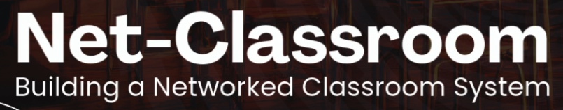
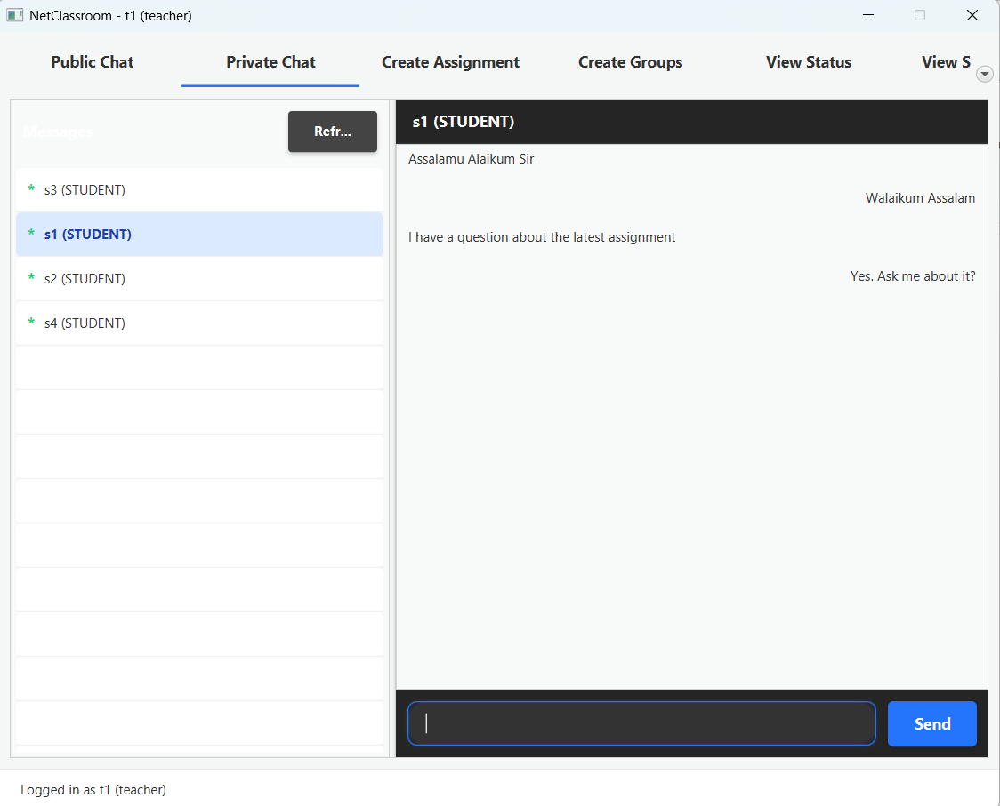
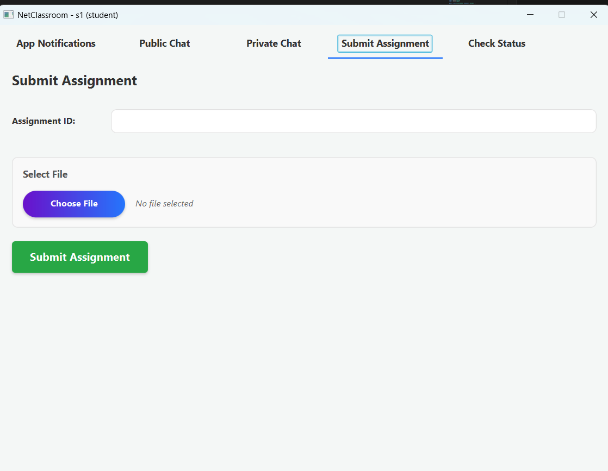

  

# 🏫 NetClassroom — TCP Networking Classroom System

A TCP-based digital classroom platform supporting real-time communication, private messaging, assignment management, and file submission using pure socket programming.

---

## 📑 Table of Contents

  
<b>Expand</b>

  - [📸 Screenshots](#-screenshots)
  - [📚 Project Overview](#-project-overview)
  - [✨ Features](#-features)
  - [🧩 Networking Concepts Applied](#-networking-concepts-applied)
  - [🏗️ Architecture](#-architecture)
  - [🛠️ Tech Stack](#-tech-stack)
  - [📋 Prerequisites](#-prerequisites)
  - [🚀 Installation & Setup](#-installation--setup)
  - [🧑‍💻 Usage](#-usage)
  - [📂 File Structure](#-file-structure)
  - [🧪 Result Highlights](#-result-highlights)
  - [⚠️ Limitations & Future Work](#️-limitations--future-work)
  - [👥 Contributors](#-contributors)
  - [📄 Resources](#-resources)
  - [📩 Support & Contact](#-support--contact)

---

## 📸 Screenshots

  
  
  
  

---

## 📚 Project Overview

**NetClassroom** is a custom networked classroom system built entirely using:

✔ TCP socket programming  
✔ Multi-threaded client–server communication  
✔ JavaFX graphical interface for enhanced UX  

The platform demonstrates core computer networking concepts including:

> socket programming, session management, reliable data transfer, flow control, congestion control, and multiplexing

Developed as part of the **CSE-3111 Computer Networking Project** at the **University of Dhaka**.

---

## ✨ Features

### 👤 User Roles
- **Teacher**
- **Student**

### 💬 Communication
- Public classroom chat
- Private direct messaging (Teacher ↔ Student, Student ↔ Student)

### 📂 Assignments
- Create **solo** & **group** assignments
- Dynamic group formation
- File submission
- Submission tracking & status logs

### 🖥️ Clients
- CLI Terminal client
- JavaFX GUI client

---

## 🧩 Networking Concepts Applied

| Concept | Implementation |
|---|---|
| **Socket Programming** | Persistent TCP sockets for communication |
| **Client–Server Model** | Server routes & broadcasts client requests |
| **Reliable Data Transfer** | TCP ensures ordered and lossless messages |
| **Flow Control** | TCP auto-adjusts for receiver buffer |
| **Congestion Control** | TCP cwnd adapts under file uploads |
| **Session Management** | Per-client user session objects |
| **Multiplexing** | Multi-threaded connection handling |

---

